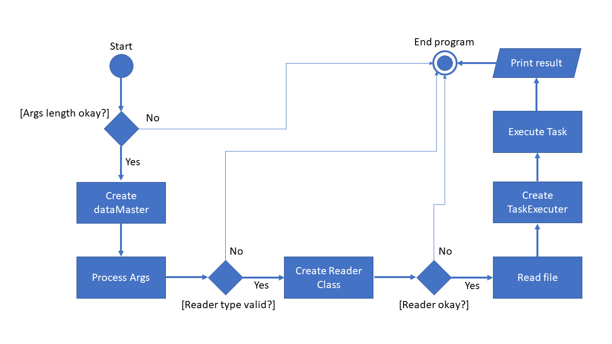

# eXXcellent programming challenge

Dies ist meine Lösung zur Programming challenge
von eXXcellent solutions

Die Lösung beinhaltet ein generalisiertes Vorgehen nach dem Factory-Pattern
zur Einbettung und Ausführung von Aufgaben über CLI-Argumente.

## Installation

Zum Klonen des Projektes nutzen Sie den folgenden Befehl:
```
git clone https://github.com/RavellHeerdegen/ExxcellentSolutions.git
```

## Ausführen Voraussetzungen

Die Lösung setzt voraus, dass alle notwendigen Argumente über das CLI übergeben werden.
Dadurch sind zukünftige Aufgaben leichter umsetzbar und das Programm gut erweiterbar.

Insgesamt müssen vier Argumente übergeben werden

    1. Der Dateiname der Datei, die gelesen werden soll (inkl. Dateiendung) -> Das Programm sucht nach Dateien im Pfad resources/de/exxcellent/files
    2. Die Aufgabe in Kleinbuchstaben und durch `&`-Zeichen gebündelt
    3. Die Felder zur Berechnung in Kleinbuchstaben und durch `&`-Zeichen gebündelt
    4. Der Name des Ergebnisfeldes, wessen Wert nach der Berechnung zurückgegeben wird
    
Die aktuelle Lösung funktioniert ausschließlich mit .CSV-Dateien, ist jedoch erweiterbar auf Dateitypen wie JSON.
    
Um das Maven Projekt zu initialisieren, laden Sie das Projekt in einer IDE Ihrer Wahl und führen Sie folgende Befehle aus:

### Builden & testen des Projektes

    `mvn verify`

### Um die main-Klasse _de.exxcellent.challenge.App_ für die Aufgabe "Weather" auszuführen

    `mvn exec:java -Dexec.args="'weather.csv' 'smallest&diff' 'MnT&MxT' 'Day'"`
    
### Um die main-Klasse _de.exxcellent.challenge.App_ für die Aufgabe "Football" auszuführen

    `mvn exec:java -Dexec.args="'football.csv' 'smallest&diff' 'Goals&Goals Allowed' 'Team'"`

### Um den Kompilierungsoutput zu löschen

    `mvn clean`

Oder nutzen Sie Ihre eigenen IDE Funktionalitäten, um das Projekt zu builden, testen und zu starten.

## Infos zur Lösung

Der main-Code ist bildlich im unten aufgeführten Flussdiagramm und Systemdiagramm einsehbar.




